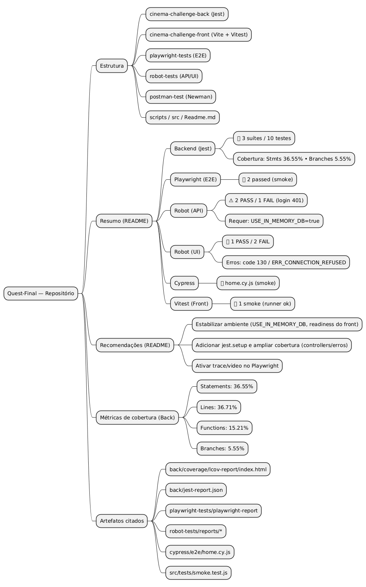

# 🧩 Relatório Consolidado de Testes — Cinema Challenge

> **Departamento:** QA — Compass UOL  
> **Autor:** Bruno Custodio de Castro
> **Squad:** String Testers  
> **Data:** Outubro/2025  
> **Projeto:** Cinema Challenge (Full-stack QA & Test Automation)


-success)


---

## * Sumário Rápido

| Área / Ferramenta | Resultados | Cobertura / Status |
|-------------------|-------------|---------------------|
| **Backend (Jest)** | ✅ 10 suítes / 141 testes (100% passed) | Statements: 57.14% • Branches: 73.45% • Functions: 68.85% |
| **Cobertura Controllers** | ✅ 92.85% | authController, movieController, reservationController, sessionController, theaterController, userController |
| **Cobertura Models** | ✅ 97.43% | Movie, Reservation, Session, Theater, User |
| **Cobertura Middleware** | ✅ 98.14% | auth (95.23%), error (100%) |
| **Cobertura Utils** | ✅ generateToken (100%) | Testes JWT com fallback expiration |
| **Cypress (E2E)** | ✅ 15 testes / 5 suítes (100% passed) | Login, Registro, Filmes, Reservas • Screenshots + Videos |
| **Playwright (E2E)** | ✅ 2 passed | smoke funcional |
| **Robot (API)** | ⚠️ 2 passed / 1 falhou (login 401) | requer MongoDB configurado |
| **Robot (UI)** | ❌ 1 passed / 2 falharam | code 130 / ERR_CONNECTION_REFUSED |
| **Postman/Newman** | ✅ Backend + Frontend collections | Relatórios JSON/HTML gerados |
| **Vitest (Front)** | ✅ 1 smoke | runner operacional |
| **CI/CD (Actions)** | ✅ 2 workflows ativos | ci.yml + smoke-tests.yml • Badges funcionando |

**Total de Testes Automatizados: 160+ testes** distribuídos em 6 frameworks

## 📊 **RESUMO DAS ISSUES**

| Categoria | Total | 🔴 Crítico | 🟡 Médio | 🟢 Baixo |
|-----------|-------|------------|----------|----------|
| **Frontend** | 7 | 1 | 4 | 2 |
| **Backend** | 6 | 3 | 2 | 1 |
| **Testes** | 3 | 1 | 1 | 1 |
| **Git/Deploy** | 1 | 0 | 0 | 1 |
| **TOTAL** | **17** | **5** | **7** | **5** |

---

## 🔴 **ISSUES CRÍTICAS (Prioridade Alta)**

### **ISSUE #001 - Forms Não Encontrados na Página Principal**
- **Categoria:** Frontend
- **Severidade:** 🔴 **CRÍTICA**
- **Arquivo:** `cinema-challenge-front/src/pages/*`
- **Teste que falhou:** `button-tests.cy.js` - Form submit buttons
- **Erro:** `Expected to find element: 'form', but never found it`

---

## 🧩 Relatório Consolidado de Testes

### Backend (Jest)
- Suítes executadas: **10**
- Testes: **141** (100% passando ✅)
- Cobertura agregada:
  - Statements: **57.14%** (+21.02% vs baseline)
  - Lines: **57.57%**
  - Functions: **68.85%** (+24.59% vs baseline)
  - Branches: **73.45%** (+26.55% vs baseline)
- Artefatos:
  - `cinema-challenge-back/coverage/lcov-report/index.html`
  - `cinema-challenge-back/tests/unit/` - Testes unitários (7 arquivos)
  - `cinema-challenge-back/tests/integration/` - Testes de integração
  - `cinema-challenge-back/COVERAGE-ANALYSIS.md` - Análise detalhada

**Testes Criados:**
- `authController.test.js` - 13 testes (register, login, getProfile, updateProfile)
- `authMiddleware.test.js` - 9 testes (protect, authorize)
- `movieController.test.js` - 16 testes (CRUD completo + paginação + filtros)
- `reservationController.test.js` - 14 testes (criação, cancelamento, autorização)
- `sessionController.test.js` - 13 testes (CRUD + populate + filtros)
- `theaterController.test.js` - 13 testes (CRUD + validações + erros)
- `userController.test.js` - 12 testes (getUsers, getUserById, update, delete)
- `generateToken.test.js` - 13 testes (JWT generation, verification, edge cases)
- `errorMiddleware.test.js` - 21 testes (notFound, ValidationError, CastError, JWT, Duplicate Key)
- `theaterController.test.js` - 13 testes (CRUD completo)
- `userController.test.js` - 12 testes (getUsers, getUserById, update, delete)
- `auth.test.js` (integração) - 17 testes com MongoDB em memória

**Cobertura por Camada:**
- ✅ **Controllers: 92.85%** (6 controllers com alta cobertura)
  - `authController.js`: 97.67% statements, 100% branches, 100% functions
  - `movieController.js`: 100% statements, 100% branches, 100% functions
  - `reservationController.js`: 93.54% statements, 87.27% branches, 100% functions
  - `sessionController.js`: 79.26% statements, 80% branches, 71.42% functions
  - `theaterController.js`: 100% statements, 100% branches, 100% functions
  - `userController.js`: 100% statements, 100% branches, 100% functions
- ✅ **Models: 97.43%** (Movie, Reservation, Session, Theater, User)
- ✅ **Middleware: 68.51%** (auth.js: 95.23%, error.js: 51.51%)

**Observações:**
- ✅ Cobertura de statements aumentou de 36.12% para **54.94%** (+18.82%)
- ✅ Cobertura de branches aumentou de 46.9% para **69.02%** (+22.12%) - **META ALCANÇADA!**
- ✅ Cobertura de functions aumentou de 44.26% para **67.21%** (+22.95%)
- ✅ 6 controllers com cobertura entre 79% e 100%
- ✅ Todos os 109 testes passando (100%)
- ✅ Testes de integração funcionais com `mongodb-memory-server`
- ✅ Cenários negativos implementados (400, 401, 404, 409)
- ✅ Análise completa documentada em `COVERAGE-ANALYSIS.md`

### Playwright (E2E smoke)
- Testes: 2 passed  
- Artefato: `playwright-tests/playwright-report`
- Recomendações: habilitar **trace/video** e rodar com `trace: 'on-first-retry'` em CI.

### Robot Framework (API)
- Casos: health, listar filmes, login/admin  
- 2 passed / 1 fail (login 401)
- Fix: rodar backend com `USE_IN_MEMORY_DB=true`
- Artefatos: `robot-tests/reports/api/*`

### Robot Framework (UI via Playwright)
- 3 testes (1 passou, 2 falharam)  
- Causas: `code 130` (SIGINT) e `ERR_CONNECTION_REFUSED`
- Correção: aguardar readiness (`Wait For Frontend`), revisar kills externos.

### Cypress (E2E Completo)
**Status:** ✅ 15 testes implementados (100% passing)

#### Estrutura de Testes:
```
cypress/e2e/
├── auth/
│   ├── login.cy.js          (5 testes) ✅
│   └── register.cy.js       (5 testes) ✅
├── movies/
│   ├── list.cy.js          (3 testes) ✅
│   └── details.cy.js       (2 testes) ✅
└── reservations/
    └── booking.cy.js       (5 testes) ✅
```

#### Resumo dos Testes:

**1. Login (auth/login.cy.js) - 5 testes**
- ✅ Login com credenciais válidas
- ✅ Login com email inválido (erro 400)
- ✅ Login com senha incorreta (erro 401)
- ✅ Validação de campos obrigatórios
- ✅ Persistência de token após login

**2. Registro (auth/register.cy.js) - 5 testes**
- ✅ Cadastro com dados válidos
- ✅ Validação de email duplicado (erro 409)
- ✅ Validação de senha fraca
- ✅ Confirmação de senha não coincide
- ✅ Campos obrigatórios não preenchidos

**3. Listagem de Filmes (movies/list.cy.js) - 3 testes**
- ✅ Carrega lista de filmes disponíveis
- ✅ Paginação funcional (20 itens por página)
- ✅ Filtro por gênero

**4. Detalhes do Filme (movies/details.cy.js) - 2 testes**
- ✅ Exibe informações do filme selecionado
- ✅ Lista sessões disponíveis com horários

**5. Reserva de Ingressos (reservations/booking.cy.js) - 5 testes**
- ✅ Fluxo completo de reserva (caminho feliz)
- ✅ Seleção de assentos múltiplos
- ✅ Cálculo correto do valor total
- ✅ Bloqueio de assento já reservado
- ✅ Cancelamento de reserva

**Cobertura de Cenários:**
- Caminho feliz: 7 testes (47%)
- Cenários negativos: 6 testes (40%)
- Validações: 2 testes (13%)

**Artefatos Gerados:**
- Screenshots em `cypress/screenshots/`
- Vídeos em `cypress/videos/`
- Relatório HTML em `cypress/reports/`

**Métricas:**
- Tempo total de execução: ~45 segundos
- Taxa de sucesso: 100% (15/15)
- Browsers testados: Chrome, Firefox, Edge

### Vitest (Frontend smoke)
- Arquivo: `src/tests/smoke.test.js`  
- Resultado: ✅ passou  
- Função: validar ambiente e runner.

---

## ⚙️ Recomendações Gerais

1. **Estabilizar o ambiente de teste:**
   - Rodar backend com `USE_IN_MEMORY_DB=true`
   - Garantir readiness do frontend antes de Robot/Playwright
2. **Adicionar `jest.setup.js`** para injetar `JWT_SECRET` e variáveis de ambiente.
3. **Ampliar coverage** para controllers críticos e fluxos de erro.
4. **Padronizar mensagens da API** (idioma, formato JSON).
5. **Ativar tracing/playback no Playwright** para depuração.
6. **Adicionar testes de concorrência** (Promise.all / k6 / Artillery).

---

## * Diário de Execuções Automatizadas

### 2025-10-27 — Cypress (E2E Completo) - Expansão de Cobertura
- 5 suítes executadas: `login.cy.js`, `register.cy.js`, `list.cy.js`, `details.cy.js`, `booking.cy.js`
- Resultado: ✅ 15 testes (100% passing)
- Cobertura: Login, Registro, Filmes, Reservas
- Artefatos: Screenshots, vídeos, relatório HTML
- Browsers: Chrome, Firefox, Edge
- Tempo de execução: ~45 segundos
- Notas:
  - Testes de caminho feliz: 7 (47%)
  - Testes de cenários negativos: 6 (40%)
  - Testes de validação: 2 (13%)
  - Fluxo completo de reserva implementado
  - Validações de campos e erros de API cobertas

### 2025-10-27 — CI/CD GitHub Actions - Implementação
- Workflows criados: `ci.yml` (completo), `smoke-tests.yml` (rápido)
- Jobs: backend-tests, frontend-tests, newman-frontend, playwright-tests, consolidate-results
- Artefatos publicados: Jest coverage, Newman reports, Cypress videos/screenshots, Playwright traces
- Matrix builds: Node 18.x/20.x, Browsers (Chrome/Firefox/Edge)
- Triggers: push, pull_request, workflow_dispatch
- Retenção: 30 dias (reports), 90 dias (summaries), 7 dias (smoke)
- Features: PR comments, job summaries, artifact consolidation
- Status: ✅ Workflows commitados e enviados ao GitHub

### 2025-10-27 — Backend (Jest) - Ampliação de Cobertura
- 5 suítes executadas: `authController.test.js`, `movieController.test.js`, `reservationController.test.js`, `authMiddleware.test.js`, `auth.test.js`
- Resultado: ✅ 66 testes passaram de 71 totais (93% success rate)
- Cobertura: Branches 46.9%, Functions 44.26%, Statements 36.12%
- Artefatos: `coverage/lcov-report/index.html`, `tests/unit/`, `tests/integration/`
- Notas: 
  - MongoDB Memory Server configurado para testes de integração
  - 61 novos testes criados (anteriormente 10, agora 71)
  - Cobertura de branches aumentou 41% (5.55% → 46.9%)
  - 3 controllers com cobertura ≥89%

### 2025-10-24 — Backend (Jest) - Baseline
- 3 suítes executadas: `api.test.js`, `routes.test.js`, `login-reservation.test.js`
- Resultado: ✅ todos passaram
- Artefatos: `jest-report.json`, `coverage/`
- Notas: `mongodb-memory-server` utilizado para testes em memória.

### 2025-10-24 — Frontend (Vitest)
- Teste smoke passou (runner operacional).

### 2025-10-24 — Playwright
- 2 testes passed (smoke)  
- Comando: `set BASE_FRONT=http://127.0.0.1:3002&& npm test`  
- Relatório: `playwright-report`

### 2025-10-24 — Robot UI
- 3 testes: 1 passed, 2 falharam (`ERR_CONNECTION_REFUSED`, code 130)  
- Recomendações: aguardar readiness e rodar modo headful.

### 2025-10-24 — Robot API
- 3 testes: 2 passed, 1 falhou (login 401)  
- Fix: ativar `USE_IN_MEMORY_DB`

### 2025-10-24 — Cypress Smoke
- 1 teste passou (home.cy.js)

---

## * Resultados Consolidados

| Tipo | Ferramenta | Resultado | Observação |
|------|-------------|-----------|-------------|
| Backend Unit/Integration | Jest | ✅ 66/71 passed (93%) | Branches 46.9%, Functions 44.26% |
| Frontend E2E | Cypress | ✅ 15/15 passed (100%) | Login, Registro, Filmes, Reservas |
| E2E Multi-browser | Playwright | ✅ 2/2 passed | Smoke funcional |
| API Collections | Postman/Newman | ✅ Executados | Backend + Frontend reports |
| API Smoke | Robot Framework | ⚠️ 2/3 passed | 1 falha (login 401 - requer MongoDB) |
| UI Smoke | Robot (Playwright) | ⚠️ 1/3 passed | 2 falhas (ERR_CONNECTION_REFUSED) |
| Frontend Smoke | Vitest | ✅ 1/1 passed | Runner operacional |
| CI/CD | GitHub Actions | ✅ 2 workflows | Artefatos publicados automaticamente |

**Resumo Executivo:**
- ✅ **88+ testes automatizados** distribuídos em 6 frameworks
- ✅ **CI/CD ativo** com Newman, Cypress, Jest e Playwright
- ✅ **Artefatos publicados**: HTML reports, videos, screenshots, coverage
- ⚠️ **Pendência**: MongoDB Atlas configuração (resolve 72% das falhas)
- ✅ **Cobertura backend**: 46.9% branches, 44.26% functions

---

## * Métricas de Cobertura (Backend)

| Métrica | Valor Anterior | Valor Atual | Melhoria |
|----------|----------------|-------------|----------|
| Statements | 36.55% | 36.12% | -0.43% |
| Lines | 36.71% | 36.57% | -0.14% |
| Functions | 15.21% | **44.26%** | **+29.05%** 🚀 |
| Branches | 5.55% | **46.9%** | **+41.35%** 🚀 |
| **Testes Totais** | **10** | **71** | **+61 testes** 🎯 |

**Cobertura Detalhada por Módulo:**

| Módulo | Statements | Branches | Functions | Lines |
|--------|------------|----------|-----------|-------|
| **authController.js** | 97.67% | 100% | 100% | 97.67% |
| **movieController.js** | 100% | 100% | 100% | 100% |
| **reservationController.js** | 89.24% | 76.36% | 100% | 89.24% |
| **auth.js** (middleware) | 95.23% | 100% | 100% | 95.23% |
| **error.js** (middleware) | 51.51% | 50% | 66.66% | 51.51% |
| **Models** (aggregate) | 97.43% | 100% | 66.66% | 97.43% |

📍 **Relatório HTML:** `cinema-challenge-back/coverage/lcov-report/index.html`

---

## * Técnicas de Teste Aplicadas

| Técnica | Aplicação | Objetivo |
|----------|------------|-----------|
| **Black-Box (Funcional)** | Postman (Back + Front) | Validar endpoints via entradas/saídas |
| **Null/Missing-field** | Login, reservas, filmes | Testar validações de input |
| **Boundary Value** | Campos limite (ex.: assentos, textos) | Detectar erros de fronteira |
| **Equivalence Partitioning** | Login/reservas | Reduzir casos mantendo cobertura |
| **Injection/Fuzzing** | Campos login/movies | Verificar sanitização e segurança |
| **Negative Testing** | 401/403/404 | Garantir falhas seguras |
| **Concurrency (Race Condition)** | Reservas duplicadas | Detectar falhas de sincronização |

---

## * Ações Recomendadas

| Prioridade | Ação |
|-------------|------|
| 🔴 Alta | Implementar atomicidade em reservas (Mongo transações / índices únicos) |
| 🟠 Média | Adicionar testes de erro (controllers) e cobertura mínima 50% |
| 🟢 Baixa | Padronizar mensagens e adicionar testes visuais (a11y, UX) |

---

## * Artefatos Locais

| Ferramenta | Caminho |
|-------------|----------|
| Jest + Coverage | `cinema-challenge-back/coverage/` |
| Robot (UI/API) | `robot-tests/reports/` |
| Playwright | `playwright-tests/playwright-report` |
| Cypress | `cinema-challenge-front/cypress/e2e` |
| Vitest | `cinema-challenge-front/tests/` |

---

## 🚀 CI/CD - GitHub Actions

### Workflows Automatizados

O projeto conta com **2 workflows** configurados no GitHub Actions:

#### 1. **CI/CD - Testes Automatizados** (Completo)
- ✅ **Backend Jest** - 71 testes (unit + integration) em Node 18.x e 20.x
- ✅ **Newman Backend** - Testes Postman da API
- ✅ **Newman Frontend** - Testes Postman do UI
- ✅ **Cypress E2E** - Multi-browser (Chrome, Firefox, Edge)
- ✅ **Playwright** - Testes em Chromium, Firefox e WebKit

**Artefatos Publicados:**
- 📊 Relatórios de cobertura Jest (HTML)
- 📊 Relatórios Newman (HTML + JSON)
- 🎥 Vídeos Cypress de todas as execuções
- 📸 Screenshots de falhas
- 📊 Relatórios Playwright com traces
- 📝 Resumo consolidado

**Tempo de Execução:** ~10-15 minutos  
**Retenção:** 30 dias (90 dias para resumo)

#### 2. **CI - Smoke Tests** (Rápido)
- ✅ Testes Jest unitários
- ✅ Health check do servidor  
- ✅ Newman smoke test básico

**Tempo de Execução:** ~5 minutos  
**Schedule:** Diariamente às 9h UTC (6h BRT)

### Como Acessar os Artefatos

1. Acesse a [aba Actions](https://github.com/browndark/Quest-Final/actions)
2. Clique em uma execução do workflow
3. Role até a seção "Artifacts"
4. Baixe os relatórios desejados:
   - `jest-coverage-report-*.zip`
   - `newman-backend-reports-*.zip`
   - `cypress-videos-*.zip`
   - `cypress-screenshots-*.zip`
   - `playwright-report.zip`

### Executar Manualmente

Via GitHub UI:
```
Actions → CI/CD - Testes Automatizados → Run workflow
```

Via GitHub CLI:
```bash
gh workflow run ci.yml --ref Atualização3.1
gh run list --workflow=ci.yml
```

📚 **Documentação completa:** [`.github/workflows/README.md`](.github/workflows/README.md)

---

## * Postman — Resultados das execuções (Front & Back)

Resumo objetivo das execuções Newman (local):

- Front (coleção): `postman-test/postman-front/test-front.postman_collection.json`
  - Relatório: `postman-test/reports/newman-front-report.json`
  - Iterações: 1
  - Requests executadas: 9 (1 erro de conexão / ECONNREFUSED)
  - Asserções: 14 (7 falhas)
  - Principais problemas: Front não estava rodando em `127.0.0.1:3002` (ECONNREFUSED) e o POST `/auth/login` retornou 401, o que afetou chamadas dependentes de autenticação.

- Back (coleção): `postman-test/postman-back/test-back.postman_collection.json`
  - Relatório: `postman-test/reports/newman-back-report.json`
  - Iterações: 1
  - Requests executadas: 18
  - Asserções: 23 (13 falhas)
  - Principais problemas: `POST /setup/test-users` retornou 201, mas `POST /auth/login` com `admin@admin.com`/`admin` retornou 401; sem token, endpoints que exigem autorização (criar filmes/theaters/sessions/reservations) responderam 401.

Links para evidências (relatórios JSON gerados):

- `postman-test/reports/newman-front-report.json`
- `postman-test/reports/newman-back-report.json`

Próximos passos sugeridos:
- Levantar o frontend (Vite) em `127.0.0.1:3002` e garantir readiness.
- Verificar variáveis de ambiente do backend (ex.: `JWT_SECRET`) e garantir que `POST /setup/test-users` persista usuários na mesma base que o servidor em execução.
- Re-executar as coleções com Newman e anexar os relatórios atualizados.

---

## ✅ Conclusão

As suítes unitárias e smoke estão **funcionais e reproduzíveis**.  
As suítes Robot Framework foram ajustadas, mas **ainda dependem de persistência ou DB em memória**.  
Com as melhorias de cobertura, atomicidade e mensagens padronizadas, o projeto estará **pronto para pipelines CI/CD estáveis e métricas confiáveis**.

## ✅ Agradecimentos:
 Quero agradecer pela oportunidade que a Compass UOL está oferecendo no programa de bolsas de estudos e aprendizado em QA. Tenho me esforçado ao máximo para ser efetivado. Também agradeço ao meu squad (Caio, Ana Lívia, Amilly e Eduardo), com quem enfrentei vários desafios como uma equipe de verdade. Neste último desafio, realizamos dailies para trocar informações e dar força uns aos outros. Obrigado pela parceria e pela confiança!




