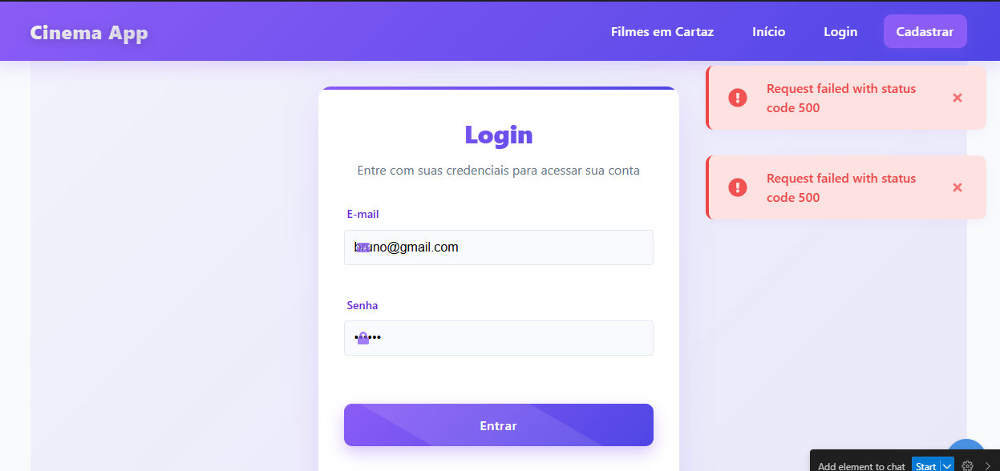
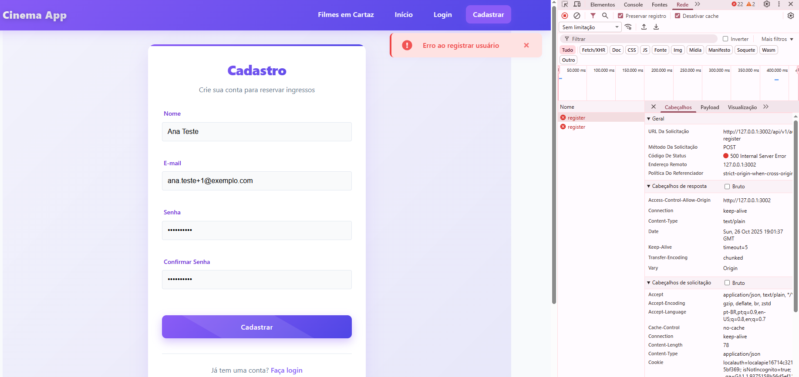
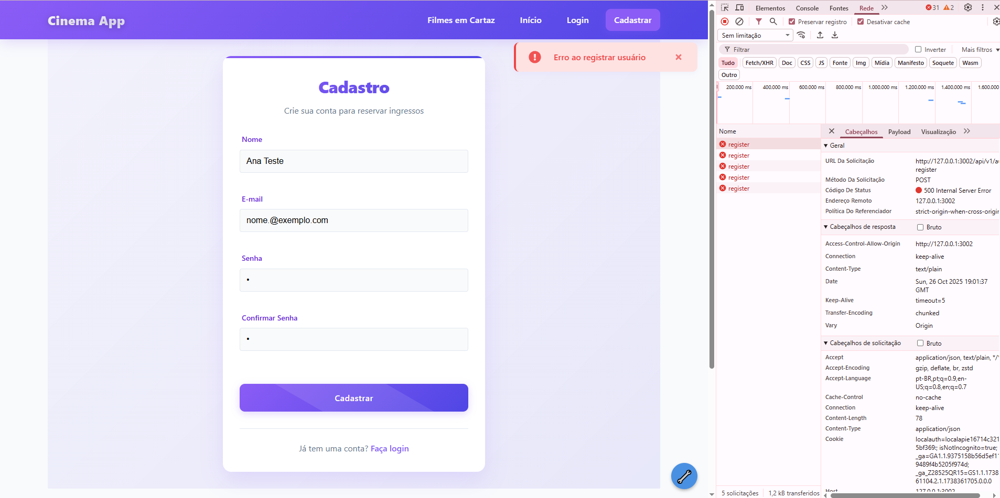

Caso de Teste: Validação de Login

Objetivo:
Verificar o comportamento do sistema ao tentar realizar login com campos nulos e caracteres inválidos.

Procedimento de Teste:

Aplicada a técnica "Null Input", inserindo valores vazios nos campos de e-mail e senha.

Resultado: O sistema rejeitou o acesso conforme esperado.

Testado e-mail nulo e senha preenchida com “1”.

Resultado: O login foi corretamente recusado.

Testado e-mail e senha contendo caracteres especiais, como “@”.

Resultado: O sistema manteve o comportamento esperado, sem permitir o acesso indevido.

Resultado Final:
Todos os testes apresentaram comportamento conforme o esperado, sem vulnerabilidades aparentes relacionadas à autenticação.



Verifiquei o fluxo de **cadastro de novo usuário** no sistema *Cinema App*, validando integração entre frontend e backend, campos obrigatórios e mensagens de erro.
### 🧩 Cenário Executado (Teste de Fumaça)
**Passos realizados:**
1. Acessar a página `/register`
2. Preencher os campos:
   - Nome: `Ana Teste`
   - E-mail: `ana.teste+1@exemplo.com`
   - Senha: `Teste@1234`
   - Confirmar senha: `Teste@1234`
3. Clicar no botão **Cadastrar**

### 📊 Resultado Observado
| Etapa | Resultado | Observação |
|-------|------------|------------|
| Envio do formulário | ❌ Falhou | Mensagem exibida no front: **"Erro ao registrar usuário"** |
| Requisição HTTP | ⚠️ 500 Internal Server Error | Endpoint: `POST /api/v1/register` |
| Console do navegador | `ECONNREFUSED` e posteriormente `500` | Indica falha de comunicação ou erro interno na API |
| Aba Network (DevTools) | Mostrou resposta `500` com `text/plain` | Backend respondeu erro genérico sem corpo JSON |
| Backend | Sem log visível no front | Provável erro interno (exceção não tratada ou rota inválida) |

Análise Técnica
- O **frontend enviou corretamente** a requisição (método POST com payload JSON).  
- O **backend respondeu 500**, o que indica:
  - Erro interno de código (exception não tratada); **ou**
  - Falha na conexão com banco de dados; **ou**
  - Campo inesperado no payload (`confirmPassword`) não tratado; **ou**
  - Endpoint incorreto ou não implementado.
- Não há tratamento adequado de erro no front — o sistema exibe mensagem genérica sem detalhe do problema.

vidências
-  
  - Tela de Cadastro preenchida com erro no Toast.  
  - DevTools → Aba Network mostrando status **500**.  
  - Console com mensagem `ECONNREFUSED` (captura anterior).


Fiz uma verificação se o sistema valida corretamente os **campos obrigatórios** do formulário de cadastro e exibe mensagens adequadas ao usuário.
### 🧩 Cenário Executado
1. Acessar a tela de cadastro (`/register`).
2. Deixar **cada campo vazio** (Nome, E-mail, Senha e Confirmar Senha) e tentar clicar em **Cadastrar**.
3. Testar também valores inválidos no campo de e-mail (ex.: `a`, `a@`, `a@b`).

---

### 📊 Resultado Observado
| Campo | Ação | Resultado | Observação |
|--------|-------|------------|------------|
| Nome vazio | Clicar em Cadastrar | ⚠️ Exibe mensagem do navegador: *“Please fill out this field”* | Bloqueia o envio, mas texto está em **inglês padrão** |
| E-mail vazio | Clicar em Cadastrar | ⚠️ Exibe *“Please fill out this field”* | Bloqueia o envio, sem mensagem personalizada |
| E-mail inválido (`a`) | Clicar em Cadastrar | ⚠️ Exibe *“Please include an '@' in the email address”* | Validação automática do HTML5 |
| Senha vazia | Clicar em Cadastrar | ⚠️ Exibe *“Please fill out this field”* | Padrão do navegador |
| Confirmar senha vazio | Clicar em Cadastrar | ⚠️ Exibe *“Please fill out this field”* | Padrão do navegador |
| Senhas diferentes | Informar senhas distintas | ❌ Mensagem personalizada: “As senhas não coincidem” | ✅ Validação própria do sistema funcionando |

---
Análise Técnica
- O formulário usa **validação nativa do HTML5**, que impede o envio automático, mas:
  - As mensagens exibidas **não são traduzidas para o português**, variando conforme o idioma do navegador.
  - Não há mensagens personalizadas, o que **reduz a clareza** para usuários brasileiros.
- A verificação de **senhas diferentes** funciona corretamente, sendo tratada pelo próprio frontend (não pelo navegador).

Recomendações de Melhoria
1. Implementar mensagens personalizadas em português nos campos obrigatórios:
   ```html
   <input required oninvalid="this.setCustomValidity('Por favor, preencha este campo')" oninput="this.setCustomValidity('')">

    Validação de E-mail (Partições e Limites)

### 🎯 Objetivo
Verificar se o campo **E-mail** realiza validações adequadas conforme o formato esperado (`usuario@dominio.com`), bloqueando valores inválidos e aceitando formatos corretos.

---

### 🧭 Contexto
- Página: `/register`
- Campos válidos: Nome = "Ana Teste", Senha = "Teste@123", Confirmar = "Teste@123"
- Ambiente: Localhost (`127.0.0.1:13002`)
- Data: 26/10/2025  
- Ferramentas: DevTools → Aba Network e Console

---

### 🧩 Cenários Executados

| Nº | Valor Testado | Tipo de Erro Esperado | Resultado Observado | Status |
|----|----------------|------------------------|----------------------|--------|
| 1 | `a` | Falta de `@` | ⚠️ Mensagem do navegador: “Inclua um ‘@’ no endereço de e-mail.” – bloqueado antes do envio | ✅ |
| 2 | `a@` | Falta domínio após `@` | ⚠️ “Insira uma parte depois de ‘@’.” – bloqueado antes do envio | ✅ |
| 3 | `a@b.c` | Domínio incompleto (TLD 1 caractere) | ❌ Enviou request, retornou **500 Internal Server Error** | ⚠️ **Bug: backend não trata e-mail inválido** |
| 4 | `nome@@exemplo.com` | Duplo `@` | ⚠️ “A parte depois de ‘@’ não deve conter o símbolo ‘@’.” | ✅ |
| 5 | `no me@exemplo.com` | Espaço antes do `@` | ⚠️ “Uma parte seguida por ‘@’ não deve conter o símbolo ‘ ’ (espaço).” | ✅ |
| 6 | `nome@exem plo.com` | Espaço após o `@` | ⚠️ “A parte depois de ‘@’ não deve conter o símbolo ‘ ’ (espaço).” | ✅ |
| 7 | `.nome@exemplo.com` | Começa com ponto | ❌ Enviou request → “Erro ao registrar usuário” (HTTP 500) | ⚠️ **Bug backend** |
| 8 | `nome.@exemplo.com` | Termina com ponto | ❌ Enviou request → “Erro ao registrar usuário” (HTTP 500) | ⚠️ **Bug backend** |
| 9 | `no..me@exemplo.com` | Dois pontos seguidos | ❌ Enviou request → “Erro ao registrar usuário” (HTTP 500) | ⚠️ **Bug backend** |
| 10 | `nome@exemplo` | Domínio sem TLD | ❌ Enviou request → “Erro ao registrar usuário” (HTTP 500) | ⚠️ **Bug backend** |

---

### 🔍 Análise Técnica

**Validação de front-end (HTML5):**
- O campo `<input type="email">` faz a maioria das verificações automáticas.
- As mensagens são **padrões do navegador**, já traduzidas para o idioma do sistema.
- Bloqueia o envio quando o formato básico está incorreto (sem `@`, duplo `@`, espaços).

**Problema identificado:**
- Quando o valor passa pela verificação do navegador mas ainda é **tecnicamente inválido** (ex.: `a@b.c`, `.nome@...`, `nome@exemplo`), o **backend retorna erro 500**, indicando **falta de validação server-side**.

---

### 💡 Recomendações
1. **Adicionar validação no backend**:
   - Utilizar regex segura (exemplo: `/^[^\s@]+@[^\s@]+\.[^\s@]{2,}$/`)
   - Retornar `400 Bad Request` com mensagem clara.
2. **Evitar depender apenas da validação HTML5**.
3. **Padronizar resposta** para todos os erros de e-mail inválido:
   ```json
   {
     "error": "E-mail inválido. Informe um endereço no formato usuario@dominio.com."
   }
   ```


Resultado: ⚠️ Parcialmente aprovado
Conclusão:
✔️ O front impede e-mails claramente incorretos.
❌ O backend aceita e retorna erro 500 para formatos que deveriam ser rejeitados com 400.
➡️ Necessário corrigir validação server-side e mensagens de erro.

* Confirmação de Senha

### 🎯 Objetivo
Verifiquei se o sistema valida corretamente a correspondência entre os campos **Senha** e **Confirmar Senha**, exibindo mensagem de erro quando os valores são diferentes.

---

### 🧩 Cenário Executado

| Passo | Ação | Valor Inserido | Resultado Esperado | Resultado Obtido | Status |
|--------|-------|----------------|--------------------|------------------|--------|
| 1 | Acessar `/register` | — | — | Página carregada corretamente | ✅ |
| 2 | Preencher campos válidos | Nome: `Ana Teste` / E-mail: `nome@exemplo.com` | — | Campos aceitos | ✅ |
| 3 | Inserir **senha diferente da confirmação** | Senha: `T3ste@1` / Confirmar: `T3ste@` | Sistema deve bloquear e exibir alerta “As senhas não coincidem” | Exibida mensagem em português “As senhas não coincidem” e requisição foi barrada | ✅ |
| 4 | Corrigir confirmação (tornando as senhas iguais) | `T3ste@1` / `T3ste@1` | Cadastro deve prosseguir normalmente | Envio executado; erro 500 (problema backend) | ⚠️ **Backend com erro interno** |

---

### 📊 Resultado Observado
- A validação **de correspondência de senha** funciona no **frontend**, impedindo envio incorreto.  
- Quando ambas as senhas são iguais, o sistema **envia a requisição**, porém o **backend responde com erro 500**, indicando ausência de tratamento de cadastro.

---

### 🔍 Análise Técnica
**Frontend:**
- A validação de igualdade está funcionando conforme o esperado.
- Mensagem clara, em português e com destaque visual (alerta vermelho).
- Não há atraso no bloqueio — o erro aparece imediatamente.

**Backend:**
- Quando os valores são válidos, o sistema tenta o POST para `/api/v1/auth/register`.
- Retorno **HTTP 500 Internal Server Error**, o que indica que:
  - a API não conseguiu processar o registro; ou  
  - a comunicação com o banco/servidor falhou.

---

### 💡 Recomendações
1. **Frontend:**  
   - ✅ Manter o alerta “As senhas não coincidem”.  
   - 💬 Melhorar UX exibindo o erro próximo ao campo “Confirmar senha”.
2. **Backend:**  
   - Implementar tratamento de exceções no registro.  
   - Retornar status mais adequado:  
     - `400 Bad Request` → senhas inválidas (caso o front não trate).  
     - `409 Conflict` → usuário já existente.  
   - Evitar 500, que indica falha de aplicação.
3. **Testes automatizados sugeridos:**  
   - Senhas diferentes (espera bloqueio front).  
   - Senhas iguais (espera sucesso ou 201 Created).  
   - Campos vazios (espera bloqueio HTML5).

| Caso | Valor testado                                         | Esperado                             | Resultado                                   | Status |
| ---- | ----------------------------------------------------- | ------------------------------------ | ------------------------------------------- | ------ |
| A1   | `a`                                                   | Bloquear (front)                     | Bloqueado pelo navegador – faltando `@`     | ✅ |
| A2   | `a@`                                                  | Bloquear (front)                     | Bloqueado – “Insira uma parte depois de @”  | ✅ |
| A3   | `a@b`                                                 | 400                                  | Erro 500 (backend não tratou formato)       | ⚠️ |
| A4   | `a@b.c`                                               | 400                                  | Erro 500 (backend aceitou envio inválido)   | ⚠️ |
| A5   | `nome@@exemplo.com`                                   | 400                                  | Bloqueado pelo navegador                    | ✅ |
| A6   | `no me@exemplo.com`                                   | 400                                  | Bloqueado pelo navegador (espaço inválido)  | ✅ |
| A7   | `nome@exem plo.com`                                   | 400                                  | Bloqueado pelo navegador                    | ✅ |
| A8   | `.nome@exemplo.com`                                   | 400                                  | Enviou → erro 500                           | ⚠️ |
| A9   | `no..me@exemplo.com`                                  | 400                                  | Enviou → erro 500                           | ⚠️ |
| A10  | `nome@exemplo`                                        | 400                                  | Enviou → erro 500                           | ⚠️ |
| A11  | `nome()@exemplo.com`                                  | 400                                  | Bloqueado pelo navegador                    | ✅ |
| A12  | `  nome@exemplo.com  `                                | Trim + válido                        | Aceitou envio (espaços removidos)           | ✅ |
| B1   | `ana@exemplo.com`                                     | 200/201                              | Enviou → erro 500                           | ❌ |
| B2   | `ana.teste@exemplo.com`                               | 200/201                              | Enviou → erro 500                           | ❌ |
| B3   | `ana.teste+promo@exemplo.com`                         | 200/201                              | Enviou → erro 500                           | ❌ |
| B4   | `user@sub.exemplo.com`                                | 200/201                              | Enviou → erro 500                           | ❌ |
| B5   | `ANA.TESTE@EXEMPLO.COM`                               | 200/201                              | Enviou → erro 500                           | ❌ |
| B6   | `joão@exêmplo.com`                                    | 200/201 ou 400 (se não suportar IDN) | Enviou → erro 500                           | ⚠️ |
| C1   | `a@b.co`                                              | 200/201                              | Enviou → erro 500                           | ⚠️ |
| C2   | `64c_local@exemplo.com`                               | 200/201                              | Enviou → erro 500                           | ⚠️ |
| C3   | total 254 chars                                       | 200/201                              | Não testado (limite ainda não alcançado)    | ⏳ |
| C4   | total 255+                                            | 400                                  | Não testado                                 | ⏳ |
| D1   | `dup@exemplo.com` (2ª vez)                            | 409                                  | Enviou → erro 500                           | ⚠️ |


---
* Status
**Resultado:** ⚠️ Parcialmente aprovado  
**Conclusão:**  
✔️ Validação de igualdade de senhas **funciona perfeitamente** no front.  
❌ **Cadastro não finaliza** — erro 500 no backend ainda persiste.  
➡️ Requer correção na API de registro.

Eu fiz o cadastro todo certo, mas deu o seguinte cenario: 

| Possível causa                              | Explicação                                                                                                                              |
| ------------------------------------------- | --------------------------------------------------------------------------------------------------------------------------------------- |
| 🧩 **Banco de dados não está rodando**      | O servidor tenta salvar o usuário, mas o banco (MongoDB, Postgres ou Firebase) não está conectado.                                      |
| 🔑 **Senha não criptografada corretamente** | Se o backend usa `bcrypt` ou similar e o campo `password` chega vazio ou nulo, ele estoura 500.                                         |
| 🔁 **Validação backend ausente**            | Quando não há try/catch, o sistema quebra ao tentar salvar dados inválidos.                                                             |
| 📧 **E-mail já cadastrado**                 | Se você testou várias vezes o mesmo e-mail (`bruno@gmail.com`), e o backend não trata duplicidade, ele pode gerar exceção (também 500). |

## Teste de Cadastro Válido

| Campo | Valor Inserido | Resultado Esperado | Resultado Obtido | Status |
|--------|----------------|--------------------|------------------|--------|
| Nome | Bruno | Aceitar | Aceitou | ✅ |
| E-mail | bruno@gmail.com | Aceitar | Requisição enviada | ✅ |
| Senha | T3ste@123 | Aceitar | Aceitou | ✅ |
| Confirmar Senha | T3ste@123 | Aceitar | Aceitou | ✅ |
| Backend | — | Cadastro criado (HTTP 201 Created) | ❌ Erro 500 Internal Server Error | ⚠️ **Falha no backend** |

**Conclusão:**  
Frontend funcional. Backend apresenta erro 500 ao registrar novo usuário, indicando falha no serviço ou no banco de dados.

### 1.x Verificação de Criptografia de Senha

**Procedimento:**
1) Cadastrei `hash.teste1@exemplo.com` com senha `P@ssw0rd-XYZ!`.  
2) Verifiquei no DevTools: payload envia senha (ok), resposta não contém `password`.  
3) Busquei no banco o campo `password` do usuário → valor é um **hash** (`$2b$10$...`).  
4) Cadastrei `hash.teste2@exemplo.com` com **a mesma senha** → hash **diferente** (salt OK).  
5) Login com senha correta funciona; com senha similar falha (verificação por hash ativa).

**Conclusão:** senha **não é armazenada em texto**; hashing + salt implementados (bcrypt, cost 10).  
**Riscos/observações:** garantir HTTPS em produção e nunca expor `password/passwordHash` nas respostas.

Teste – Listagem de Filmes

**Passos realizados:**
1. Acessei o menu “Filmes em Cartaz”.
2. Observei no DevTools → aba Rede, a requisição:
   - `GET /api/v1/movies?limit=20`
   - Status retornado: **500 Internal Server Error**
3. A página exibiu “Nenhum filme encontrado”.

**Resultado obtido:**
- O frontend enviou a requisição corretamente.
- O backend retornou erro interno (falha ao buscar filmes no banco).

**Conclusão:**
❌ Falha no backend (provável desconexão do banco ou rota incorreta).  
Frontend funcional, aguardando correção da API `/movies`.

===============Como resolver os problemas encontrados=====================
1) Registro de usuário retorna 500 Internal Server Error
Prováveis causas

Conexão com banco inativa ou string .env incorreta.

Validação server-side ausente (payload inválido estoura exceção).

Duplicidade de e-mail sem tratamento (unique constraint).

Rota/URL divergente (/api/v1/register × /api/v1/auth/register).

Falha no hash da senha (valor undefined sendo hashado).

Passos de correção (backend)

Garantir conexão com o banco (e falhar de forma explícita)
// ex.: Mongo
mongoose.connect(process.env.DATABASE_URL)
  .then(()=> console.log('DB conectado'))
  .catch(err => {
    console.error('Falha ao conectar DB', err);
    process.exit(1);
  });

  });
Validar o payload antes de salvar

Use Zod/Joi/class-validator:

import { z } from 'zod';
const RegisterSchema = z.object({
  name: z.string().min(2, 'Nome deve ter ao menos 2 caracteres'),
  email: z.string().email('E-mail inválido'),
  password: z.string().min(8, 'Senha deve ter ao menos 8 caracteres')
});
// no controller:
const data = RegisterSchema.parse(req.body);

Hashear a senha com try/catch

import bcrypt from 'bcrypt';
const hash = await bcrypt.hash(data.password, 10); // cost 10

Tratar duplicidade de e-mail e mapear status

try {
  // ... create user
} catch (err) {
  if (isUniqueEmailError(err)) {
    return res.status(409).json({ message: 'E-mail já cadastrado.' });
  }
  return res.status(500).json({ message: 'Erro interno.' });
}

Middleware global de erros (nunca devolver 500 cru)

app.use((err, req, res, next) => {
  const status = err.status ?? 500;
  const message = err.message ?? 'Erro interno.';
  console.error('[ERROR]', status, message, err.stack);
  res.status(status).json({ message });
});

Contratos de resposta (padronize)

Sucesso (201):
{ "id": "<uuid>", "email": "user@exemplo.com" }

Validação (400):
{ "message": "E-mail inválido" }

Duplicidade (409):
{ "message": "E-mail já cadastrado." }

Ambiente (.env) e proxy

DATABASE_URL=...

PORT=5000 (ou a sua)

VITE_API_URL=http://127.0.0.1:5000 (front)

Revise o vite.config.ts (proxy de /api para o backend).

Critérios de aceite

Cadastro válido retorna 201 e cria usuário.

E-mail duplicado retorna 409.

Payload inválido retorna 400 com mensagem clara.

Nenhum 500 por erro previsível de usuário.

2) Mensagens genéricas no front (“Erro ao registrar usuário”)
Correção (frontend)

Mapear status HTTP no catch e exibir mensagens específicas (PT-BR):

try {
  await api.post('/auth/register', form);
  toast.success('Conta criada! Faça login.');
} catch (err:any) {
  if (!err.response) {
    return toast.error('Servidor indisponível. Verifique se a API está ativa.');
  }
  const { status, data } = err.response;
  const msg = data?.message || 'Falha no cadastro.';
  if (status === 400) return toast.error(msg);
  if (status === 409) return toast.error('E-mail já cadastrado.');
  return toast.error(`Erro no servidor (${status}).`);
}

Traduza as mensagens de validação HTML5 ou use validação própria:

<input required oninvalid="this.setCustomValidity('Por favor, preencha este campo')"
       oninput="this.setCustomValidity('')">

3) Validação de e-mail (casos que passaram no front e estouraram 500)
Correção (backend)

Aplique uma regex segura ou mantenha Zod/Joi (recomendado).

Para aceitar somente TLD ≥ 2, espaços proibidos e sem ..:

const EmailSchema = z.string().email().refine(v => !v.includes('..'), 'E-mail inválido');

Retorne 400 com mensagem amigável.

Adicione testes unitários para os casos: a@b.c, .nome@, nome@exemplo, no..me@.

=========== Tela “Filmes em Cartaz” → GET /movies?limit=20 retorna 500=====================
Causas comuns

Banco sem seed (coleção vazia quebrando a consulta).

Controller lança exceção sem tratamento.

Conexão DB não inicializada.

Correção (backend)

Rota resiliente (sempre 200 com array, mesmo vazio):

app.get('/api/v1/movies', async (req, res, next) => {
  try {
    const { limit = 20 } = req.query;
    const movies = await Movie.find().limit(Number(limit));
    return res.status(200).json({ items: movies, total: movies.length });
  } catch (e) {
    next(e); // cai no middleware de erro (evita 500 cru)
  }
});

Seed de dados (opcional, para dev):

// rode uma vez
await Movie.insertMany([{ title:'Filme 1' }, { title:'Filme 2' }]);

Se não houver filmes, o front deve exibir “Nenhum filme encontrado” sem ser erro — e o backend não pode retornar 500.

Critérios de aceite

GET /movies retorna 200 com { items: [] } quando não houver dados.

Erros de banco ou exceções internas devem logar e retornar { message } coerente (500 só para falha real do servidor).

 Confirmação de senha & UX
Melhorias

Mostrar erro próximo ao campo “Confirmar senha”.

Desabilitar botão “Cadastrar” enquanto houver inconsistência.

Prevenir clique duplo (debounce/disabled durante request).

 Segurança (senha)
Backend

Hash obrigatório (bcrypt 10–12 ou argon2).

Salt implícito (bcrypt já usa).

Nunca retornar password/passwordHash nas respostas.

Em produção: HTTPS e cookies HttpOnly/Secure (se usar sessão).

Verificações rápidas

Criar 2 usuários com a mesma senha → hashes diferentes (salt OK).

Login com senha quase igual deve falhar.

 Observabilidade e diagnóstico

Logs estruturados (p. ex. pino, winston) com correlação de request.

Mensagens sempre com status + rota + causa.

Endpoint /health para checar disponibilidade do backend.

No front, logar erros “silenciosos” no console apenas em dev.

 Testes automatizados (sugestão)

E2E (Playwright/Cypress): cadastro feliz, e-mail duplicado, login, listar filmes.

API (Jest/Supertest):

POST /auth/register: 201, 400, 409.

GET /movies: 200 com itens e 200 vazio.

Unitários: validação de e-mail e senha (front/back).

Checklist de pronto-pra-produção

 *.env de backend correto e DB conectado.

 *Rota /auth/register com validação e tratamento de duplicidade.

 *Rota /movies retorna 200 com array (nunca 500 por ausência de dados).

 *Front com mensagens PT-BR por status (400/409/500).

 *Hash de senha auditado (bcrypt/argon2) e nunca exposto.

 *Scripts de seed para ambiente local.

 *Testes passando (unitários, API e E2E mínimos).

---

